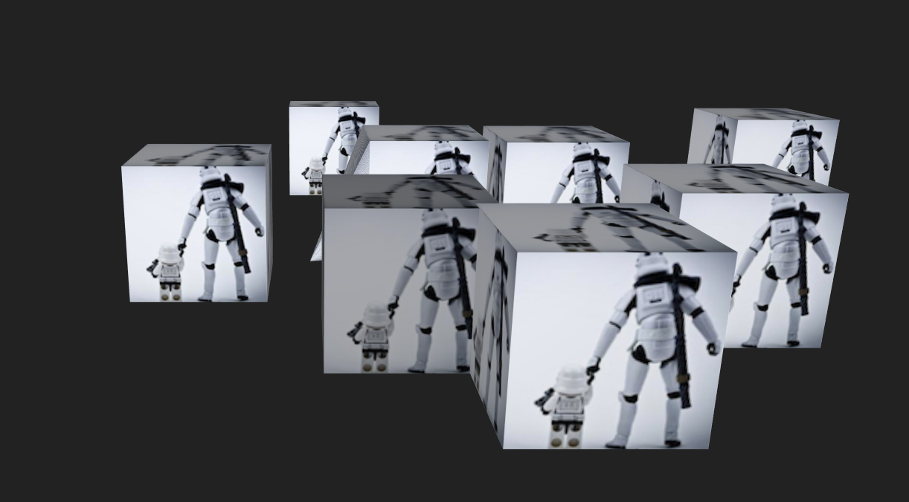

# Hightopo软件使用评估

##使用
####开发工具
    文本编辑器
####运行环境
    任何支持HTML5标准的浏览器。多年前的Chrome、Firefox、Safari和Opera版本都已经支持HTML5， iOS和Android等主流移动设备的浏览器也都已
    支持HTML5，IE需要IE9及以上的版本， 如果采用HT for Web 3D则需要IE11及以上版本支持，建议尽量采用最新版本浏览器。
####使用方法
页面引入ht.js文件
添加如下代码
```
function init() {
    //创建3D环境场景
    var g3d = new ht.graph3d.Graph3dView();
    //获取场景的DOM对象
    var view = g3d.getView();
    //将场景添加到DOM中
    g3d.addToDOM();
    //场景样式配置
    view.style.background = "#222222";
    //获得场景的数据模型
    var dataModel = g3d.dm();

    //新建节点
    var node = new ht.Node();
    //节点样式配置
    node.s({
        //设置节点表面贴图
        'all.image': 'res/box.png', 
        'all.light': true
    })
    //节点坐标
    node.p3(-300, 160, -100)
    //节点大小
    node.s3(150, 320, 150);
    //节点添加到数据模型中
    dataModel.add(node);
}
```
设置```init```方法在页面```onload```事件运行

####测试结果

初始化场景中生成1000节点，可以流畅操作
***

####注意点
* 节点与后台数据模型的关联
每个节点可以设置tag属性，功能类似id，数据模型可以通过tag查找到场景  
内存储的节点
* 场景的事件监听
addInteractorListener(listener, scope, ahead)添加交互时间监听
监听事件回调内可以判断事件类型(事件类型名是HTML事件名称前加data)
和触发事件的数据模型来对每个节点实现事件监听